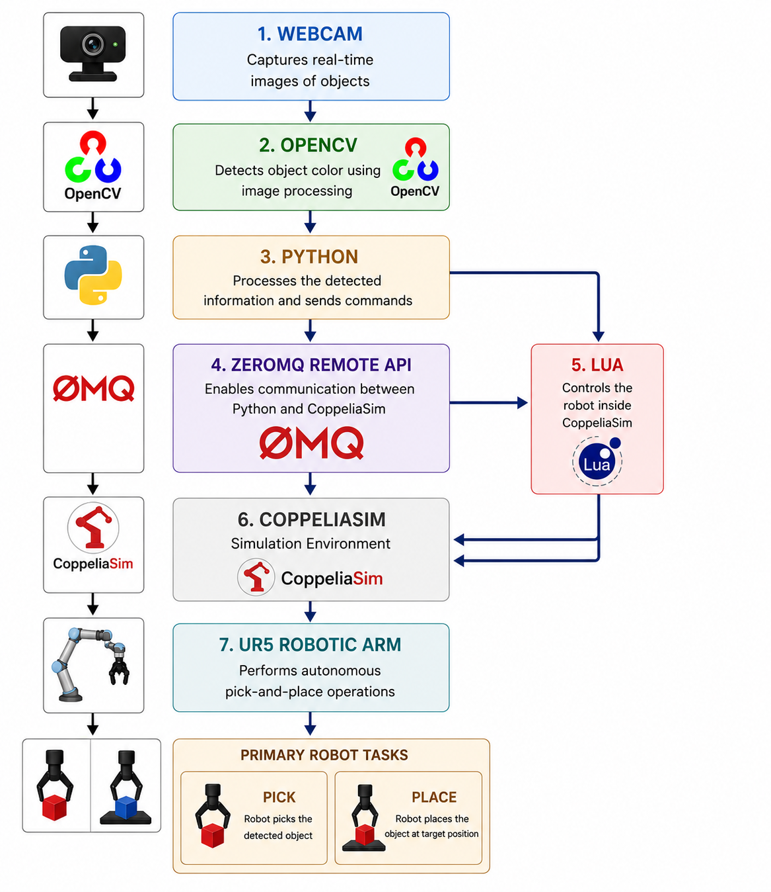
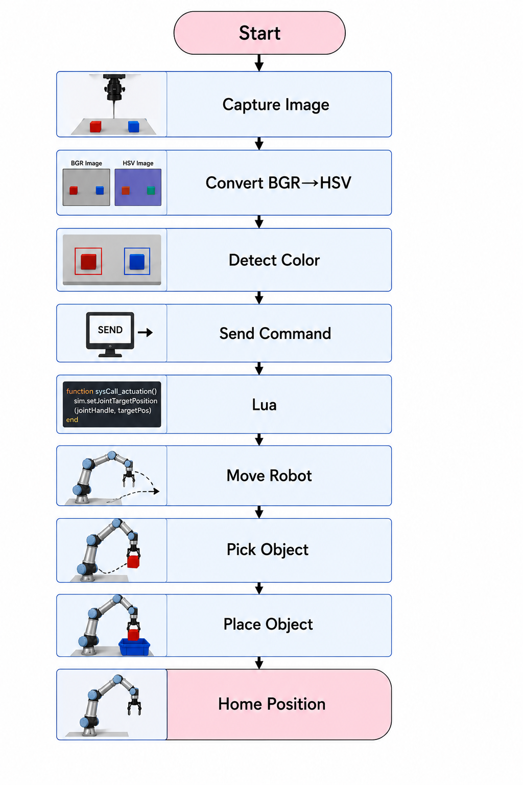
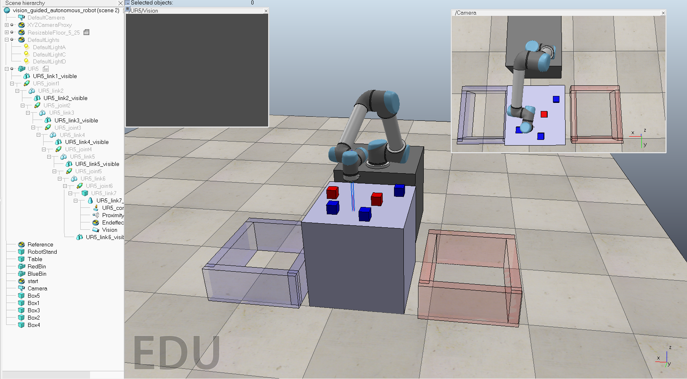
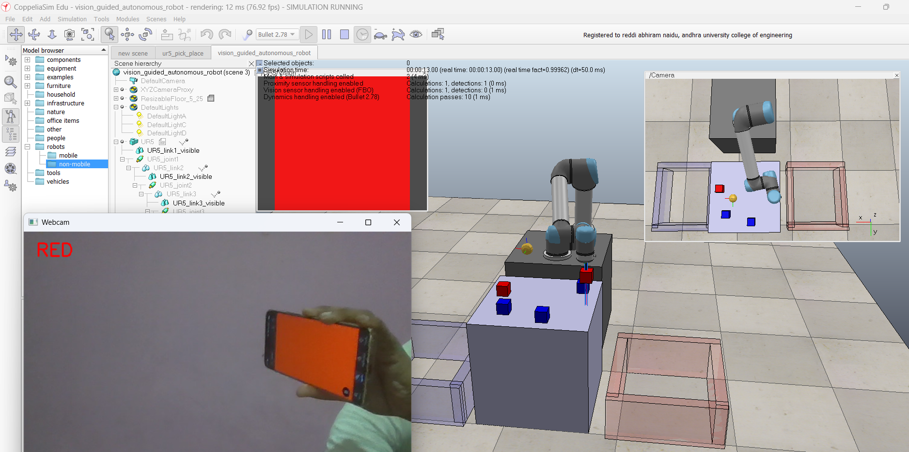
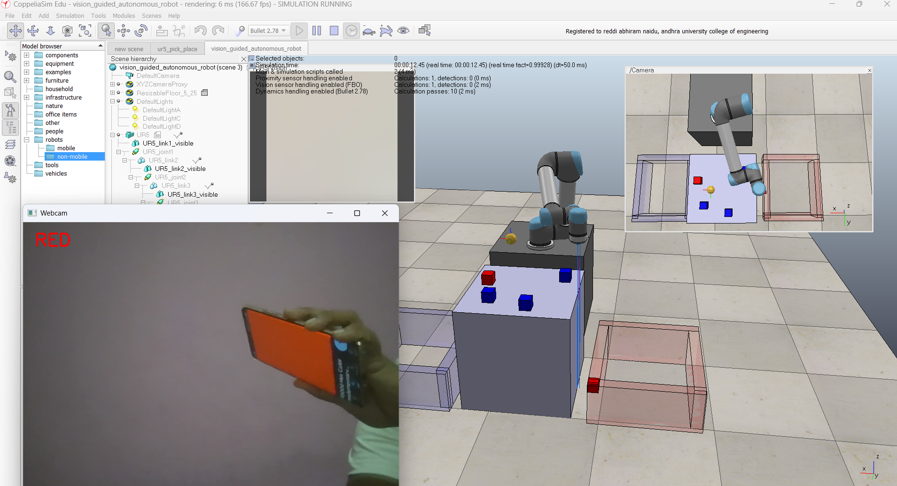
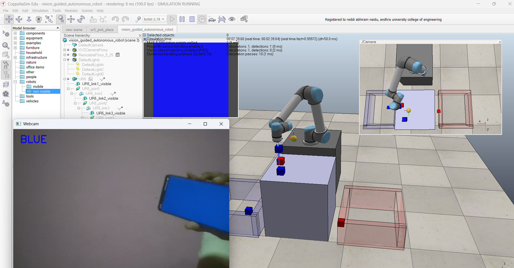
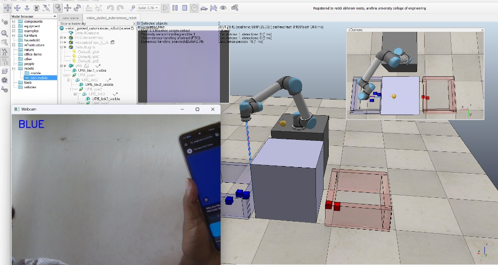

# Vision-Guided Robotic Arm

A vision-guided robotic arm simulation that uses computer vision to detect objects and autonomously perform pick-and-place operations in a simulated environment.

## 📌 Project Overview

This project demonstrates the integration of computer vision, Python programming, and robotic simulation for autonomous object handling.

A webcam captures the workspace, while OpenCV processes the visual information to identify the target object based on its color. The detected information is communicated to a UR5 robotic arm simulated in CoppeliaSim through the ZeroMQ Remote API. The robotic arm then moves to the target location, performs the pick operation, and places the object in the corresponding color bin.

## 🎯 Objectives

- Detect objects using computer vision.
- Identify the target object based on color.
- Establish communication between Python and CoppeliaSim.
- Control a UR5 robotic arm in simulation.
- Perform autonomous pick-and-place operations.
- Demonstrate the application of computer vision in robotic automation.

## 🛠️ Technologies Used

| Technology | Purpose |
|---|---|
| Python | Main programming and robot control |
| OpenCV | Computer vision and color detection |
| CoppeliaSim | Robotic simulation environment |
| UR5 | Simulated robotic arm |
| Lua | Robot-side simulation control |
| ZeroMQ Remote API | Python–CoppeliaSim communication |

## 🏗️ System Architecture

The system integrates the webcam, OpenCV, Python, ZeroMQ Remote API, Lua, CoppeliaSim, and the UR5 robotic arm.



### System Flow

**Webcam → OpenCV → Python → ZeroMQ Remote API → Lua/CoppeliaSim → UR5 Robotic Arm**

## ⚙️ Working Principle

The system operates through the following sequence:

1. **Image Capture**  
   The webcam captures the workspace containing the colored objects.

2. **Image Processing**  
   Python and OpenCV process the captured image.

3. **Color Detection**  
   The image is converted from BGR to HSV color space and the target object's color is detected.

4. **Command Generation**  
   Python determines the detected color and sends the corresponding command to CoppeliaSim through the ZeroMQ Remote API.

5. **Robot Control**  
   Lua scripts inside CoppeliaSim receive the command and control the simulated UR5 robotic arm.

6. **Pick Operation**  
   The UR5 moves to the detected object and picks it using the end-effector.

7. **Place Operation**  
   The robot moves to the corresponding color bin and places the object.

8. **Return to Home Position**  
   The robotic arm returns to its predefined home position.



## 🔄 System Workflow

```text
Webcam
   ↓
Image Acquisition
   ↓
BGR → HSV Conversion
   ↓
Color Detection
   ↓
Python Processing
   ↓
ZeroMQ Remote API
   ↓
CoppeliaSim / Lua
   ↓
UR5 Robotic Arm
   ↓
Pick Object
   ↓
Place in Corresponding Bin
   ↓
Return to Home Position
```

## 🧪 Simulation Results

The system was tested using red and blue objects. The robotic arm successfully detects the object color and performs the corresponding pick-and-place operation.

### Simulation Workspace



### Red Object Pick



### Red Object Place



### Blue Object Pick



### Blue Object Place



## 🎥 Simulation Demonstration

A complete simulation video demonstrating the vision-guided pick-and-place operation is included in the repository.

[▶️ Watch the Simulation Video](video/simulation.mp4)

## 📂 Project Structure

```text
VGARA/
├── autonomous.py
├── README.md
├── vision_guided_autonomous_robot.ttt
│
├── docs/
│   ├── system-architecture.png
│   └── working-flow.png
│
├── images/
│   ├── workspace.png
│   ├── red-pick.png
│   ├── red-place.png
│   ├── blue-pick.png
│   └── blue-place.jpg
│
└── video/
    └── simulation.mp4
```

## ▶️ How to Run

### Requirements

- Python 3.x
- CoppeliaSim
- Webcam
- OpenCV
- CoppeliaSim ZeroMQ Remote API client

### Steps

1. Clone the repository.

2. Open the project directory.

3. Open `vision_guided_autonomous_robot.ttt` in CoppeliaSim.

4. Make sure the webcam is connected and available.

5. Start the CoppeliaSim simulation.

6. Run the Python program:

```bash
python autonomous.py
```

7. The webcam captures the workspace and OpenCV detects the target object's color.

8. The detected color is communicated to CoppeliaSim through the ZeroMQ Remote API.

9. The UR5 robotic arm performs the corresponding pick-and-place operation.

## 🔮 Future Scope

The system can be extended in several ways:

- Support for additional object colors and shapes.
- Integration of object detection and deep learning models.
- Improved object localization and detection accuracy.
- Integration with real robotic hardware for physical pick-and-place operations.
- Extension to industrial sorting and material-handling applications.
- Development of more advanced autonomous decision-making capabilities.

## 👨‍💻 Author

**Abhi Reddi**

Electronics and Communication Engineering  
Andhra University College of Engineering, Visakhapatnam

---

⭐ If you find this project useful, consider giving the repository a star.